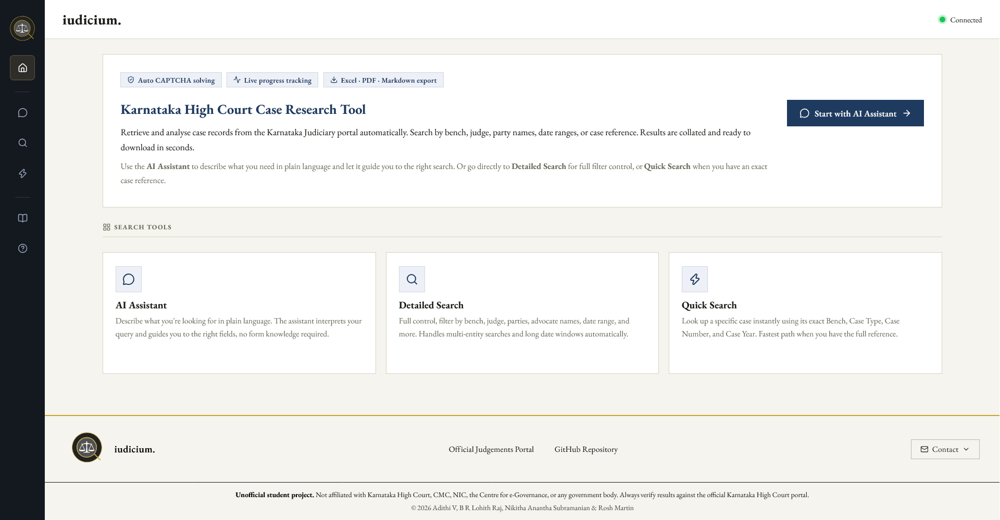
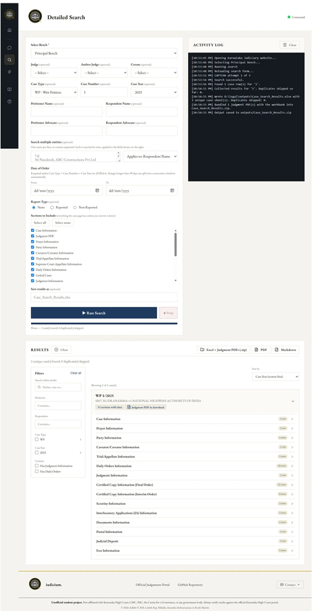
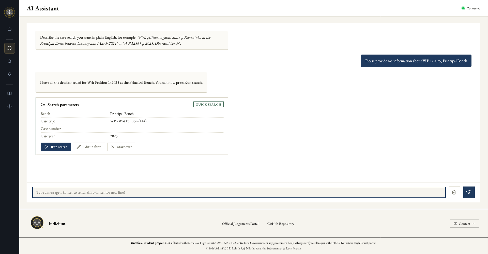
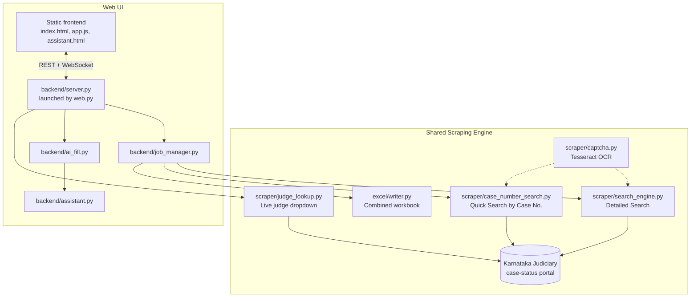

# iudicium.


> An automated case-search and reporting tool for the Karnataka Judiciary case-status portal, with a web UI, a conversational AI assistant for building searches, and consolidated Excel export.

Iudicium drives the Karnataka Judiciary's case-status search page (`rep_judgment.php`) end to end: it fills in the real search form, solves the site's CAPTCHA with OCR, works through every matching result, opens each case's detail page, and compiles everything into a single Excel workbook, one summary sheet plus one detail sheet per case. It also supports the site's separate "Quick Search by Case No." page for direct lookups.

## Table of Contents

- [Overview](#overview)
- [Screenshots](#screenshots)
- [Key Features](#key-features)
- [Technology Stack](#technology-stack)
- [System Architecture](#system-architecture)
- [Repository Structure](#repository-structure)
- [Search Pipeline](#search-pipeline)
- [Conversational Assistant](#conversational-assistant)
- [Case Detail Sections](#case-detail-sections)
- [Installation](#installation)
  - [Docker](#docker)
- [Getting a Gemini API Key](#getting-a-gemini-api-key)
- [Adding Tesseract to your PATH](#adding-tesseract-to-your-path)
- [Running the Application](#running-the-application)
- [Configuration Reference](#configuration-reference)
- [API Reference](#api-reference)
- [Output](#output)
- [Operational Notes](#operational-notes)
- [License](#license)

## Overview

The Karnataka Judiciary's judgment-search portal is a manual, form-driven website with no public API. Iudicium reproduces the exact behavior of the site's own form (same field IDs, same dropdown values, same 90-day date-window limit) through a headless browser, so that a search that would take many manual page loads and CAPTCHA solves can be run once and exported as a single, structured Excel file.

On top of the scraping engine, the project provides:

* A form-based search UI covering every field the live site exposes.
* A conversational "describe your search" assistant that fills the form from natural language, validates the result against the same rules as the manual form, and only ever interprets language, it never touches the target website itself.
* Live progress and log streaming over WebSocket while a search runs.
* A combined Excel export with one row per case in a summary sheet and a full detail sheet per case.

## Screenshots

**Home** — the landing page, with quick access to the AI Assistant, Detailed Search, and Quick Search.



**Detailed Search** — full field control, live activity log, and per-case results with every section broken out.



**AI Assistant** — describe a search in plain English and let the assistant fill and validate the fields for you.



## Key Features

### Search Capability

* Full Detailed Search: judge, author judge, coram, case type, case number, case year, petitioner/respondent name and advocate, date-of-order range, report type, and multi-alias search.
* Quick Search by Case Number: bench, case type, case number, and case year only, matching the site's own dedicated lookup page.
* Automatic 90-day date-window splitting for long date ranges, transparent to the caller.
* Automatic CAPTCHA solving via Tesseract OCR, with retry on failure.
* Duplicate detection across aliases and date windows.
* Early cancellation mid-run, with partial results still saved.

### AI Assistant

* Natural-language request parsing into structured, validated search fields.
* Conversational, multi-turn field collection with follow-up questions for anything missing.
* Server-side validation against the live site's own field values, the model can never submit an invalid or unvalidated value.
* Configurable LLM backend: Gemini or any OpenAI-compatible endpoint (OpenAI, Groq, a local Ollama or vLLM server).

### Reporting

* Combined `.xlsx` workbook: one summary sheet plus one detail sheet per case.
* Every case-detail section the live site exposes (party information, daily orders, linked cases, judgment information, fees, and more).
* Judgment PDF capture alongside the workbook where available.

### Delivery

* A single web UI served directly by FastAPI, with live activity log and progress bar over WebSocket.
* Downloadable workbook served directly from the backend.

## Technology Stack

| Layer                    | Technology                                         |
|--------------------------|----------------------------------------------------|
| Browser automation       | Playwright (Sync API)                              |
| CAPTCHA solving          | Tesseract OCR via `pytesseract`                    |
| Backend framework        | FastAPI (`backend/server.py`), served by `web.py`  |
| Programming language     | Python 3.11+                                       |
| Spreadsheet export       | pandas + openpyxl                                  |
| Web front end            | Static HTML, CSS, vanilla JavaScript               |
| AI assistant transport   | `httpx` against Gemini or an OpenAI-compatible API |
| Real-time updates        | WebSocket (FastAPI native)                         |
| Configuration            | `python-dotenv`, `.env`                            |
| License                  | Apache License 2.0                                 |

## System Architecture

Iudicium ships one web UI over a Playwright-driven scraper.



The static HTML/CSS/JavaScript front end is served directly by FastAPI, talking to `backend/server.py` (started with `python web.py`). It exposes every search field, the conversational assistant, live WebSocket logs, judge lookups, and the Excel/PDF download endpoints, all from a single process.

## Repository Structure

```text
iudicium/
│
├── .dockerignore                # Files and directories excluded from Docker build context
├── .env.example                 # Template for environment variables and API configuration
├── .gitignore                   # Files and directories excluded from Git tracking
├── LICENSE                      # Apache License 2.0 terms and permissions
├── NOTICE                       # Attribution and third-party notices
├── README.md                    # Project overview, setup, usage, and documentation
├── requirements.txt             # Python dependencies required by the application
├── config.py                    # URLs, form field values, and case-detail section order
├── web.py                       # Main entry point for starting the web application
├── backend.py                   # Backend service integration
├── scraper_service.py           # Scraper service integration
├── deploy.sh                    # Deployment script
├── Dockerfile                   # Docker container configuration
│
├── gemini_key.txt               # Gemini API key
│
├── scraper/
│   ├── __init__.py              # Marks scraper as a Python package
│   ├── search_engine.py         # Orchestrates a full Detailed Search run
│   ├── case_number_search.py    # Orchestrates a Quick Search by Case No. run
│   ├── judge_lookup.py          # Live Judge / Author Judge dropdown lookup
│   ├── captcha.py               # CAPTCHA screenshot capture and OCR
│   ├── table_utils.py           # Locates the judgments results table
│   ├── case_extraction.py       # Extracts case-detail sections
│   ├── pdf_capture.py           # Captures judgment PDFs where available
│   ├── section_structure.py     # Structured case-section parsing
│   ├── text_utils.py            # Text cleaning and filename/sheet-name sanitizing
│   └── date_utils.py            # Date parsing and 90-day window splitting
│
├── excel/
│   ├── __init__.py              # Marks excel as a Python package
│   └── writer.py                # Builds the combined .xlsx workbook
│
├── backend/
│   ├── __init__.py              # Marks backend as a Python package
│   ├── server.py                # FastAPI routes, static files, WebSocket log stream
│   ├── job_manager.py           # Background search job management
│   ├── assistant.py             # Conversational request → validated search fields
│   ├── ai_fill.py               # Natural language → form values
│   ├── llm.py                   # Gemini / OpenAI-compatible API transport
│   └── schemas.py               # Request and response models
│
└── frontend/
    ├── index.html               # Main landing/search page
    ├── assistant.html           # AI assistant page
    ├── case-number.html         # Case-number search page
    ├── search.html              # Detailed search page
    ├── guide.html               # User guide
    ├── faq.html                 # Frequently asked questions
    │
    ├── app.js                   # Main frontend logic
    ├── chat.js                  # AI assistant chat logic
    ├── case-number.js           # Case-number search logic
    ├── sidebar.js               # Sidebar/navigation logic
    ├── conn-status.js           # Connection status handling
    │
    ├── styles.css               # Global UI styles
    │
    ├── iudicium-logo.svg        # Full iudicium logo
    ├── iudicium-mark.svg        # iudicium logo mark
    └── robots.txt               # Search-engine crawler rules
```

## Search Pipeline

### Detailed Search

1. The caller (form, or assistant) supplies bench, optional filters, and either a date-of-order range or a complete case identity.
2. A long date range is automatically split into consecutive 90-day windows.
3. Playwright opens the live search page, fills every field exactly as the site's own form expects, and solves the CAPTCHA via OCR, retrying on failure.
4. Each matching row in the results table is opened, and every available detail section is extracted.
5. Duplicate cases (found through more than one alias or date window) are skipped and counted in the final summary.
6. All collected cases are written to a single combined Excel workbook: one summary row per case, one full detail sheet per case.

### Quick Search by Case Number

When a request is exactly bench + case type + case number + case year, Iudicium instead drives the site's separate "Quick Search by Case No." page, which returns a single case's summary block directly rather than a results table. No date range is required for this mode, matching the live site's own validation.

## Conversational Assistant

The assistant (`backend/assistant.py`) turns a chat conversation into validated search parameters:

* Every value the model proposes is checked against `config.py`, bench, case type code, case year, coram, report type, and date format are all validated in Python, not trusted from the model's output.
* The "ready to search" rule is enforced in code, not by the model: bench is always required, and either a date-of-order range or a complete case identity (type, number, year) must be present.
* Which scraper mode to run is decided by the same code: an exact case-identity request uses the Quick Search path, everything else uses the Detailed Search path.
* If the model claims a search is ready but the validation rules disagree, the rules win, and the missing fields are surfaced back to the user as a follow-up question.
* The assistant only ever interprets language. It never talks to the target website, the Playwright scraper does that, and only after validation.

## Case Detail Sections

Every detail sheet can include the following sections, in the order the live site presents them:

| Section | Section |
| --- | --- |
| Case Information | Certified Copy Information (Final Order) |
| Prayer Information | Certified Copy Information (Interim Order) |
| Party Information | Index Sheet Information |
| Caveator/Caveatee Information | Scrutiny Information |
| Trial/Appellate Information | Interlocutory Applications (IA) Information |
| Supreme Court Appellate Information | Documents Information |
| Daily Orders Information | Postal Information |
| Linked Cases | Judicial Deposit |
| Judgment Information | Fees Information |

## Installation

```bash
pip install -r requirements.txt
playwright install chromium
```

Tesseract OCR is a system binary, not a Python package, and must be installed separately:

* Windows: https://github.com/tesseract-ocr/tesseract/releases/tag/5.5.3
* macOS: `brew install tesseract`
* Linux: `sudo apt install tesseract-ocr`

The scraper looks for Tesseract automatically; if it cannot find it, set `TESSERACT_CMD` in `.env` (see [Adding Tesseract to your PATH](#adding-tesseract-to-your-path) below).

### Docker

If you'd rather not install Tesseract, Playwright, and Chromium's OS dependencies by hand, use the included `Dockerfile` instead. It installs Tesseract, installs the Python dependencies, and runs Playwright's own installer to pull Chromium plus every OS library it needs, so the resulting image is ready to run with no host setup beyond Docker itself.

```bash
docker build -t iudicium .

docker run -d \
  --name iudicium \
  -p 8000:8000 \
  --env-file .env \
  -v "$(pwd)/outputs:/app/outputs" \
  iudicium
```

* `--env-file .env` passes in your LLM provider settings (see [Configuration Reference](#configuration-reference)); copy `.env.example` to `.env` and fill it in first if you haven't already.
* `-v "$(pwd)/outputs:/app/outputs"` mounts the `outputs/` directory to the host, so generated workbooks and PDFs survive after the container stops.
* The image already sets `SCRAPER_HEADLESS=true` and `HOST=0.0.0.0`; only `PORT` (default `8000`) and your LLM keys need to come from `.env`.
* Open `http://localhost:8000` once the container is running.

## Getting a Gemini API Key

The AI assistant and the "describe your search" AI-fill feature default to Google's Gemini API (`LLM_PROVIDER=gemini` in `.env`). To get a key:

1. Go to [https://aistudio.google.com/apikey](https://aistudio.google.com/apikey) and sign in with a Google account.
2. Click **Create API key** and choose a Google Cloud project (or let Google create one for you).
3. Copy the generated key.
4. Paste it into `.env` as `GEMINI_API_KEY=your-key-here` (copy `.env.example` to `.env` first if you haven't already).

The key is read server-side only and is never sent to or exposed in the browser. If you'd rather use a different provider, set `LLM_PROVIDER=openai` and fill in `OPENAI_API_KEY` (this also covers Groq, a local Ollama server, vLLM, or any other OpenAI-compatible endpoint via `OPENAI_BASE_URL`).

If no key is configured at all, the AI assistant reports an error in the UI, but the manual form still works normally.

If you're deploying with `deploy.sh` (Google Cloud Run), the key isn't put in `.env` at all: put your raw Gemini key in a local `gemini_key.txt` file instead, and the script uploads it to Google Secret Manager and wires it in as `GEMINI_API_KEY` at deploy time.

## Adding Tesseract to your PATH

`config.py` tries a few common install locations automatically, but if Tesseract isn't found there, CAPTCHA solving will fail. You have two options: add Tesseract to your system PATH, or point `TESSERACT_CMD` at it directly in `.env`.

**Windows**

1. Install Tesseract from the [Ofiicial Source](https://github.com/tesseract-ocr/tesseract/releases/tag/5.5.3) (default install path is `C:\Program Files\Tesseract-OCR`).
2. Open **Settings → System → About → Advanced system settings → Environment Variables**.
3. Under "System variables", select `Path`, click **Edit**, then **New**, and add `C:\Program Files\Tesseract-OCR`.
4. Click OK on every dialog, then open a new terminal (existing ones won't pick up the change) and confirm with `tesseract --version`.
5. Alternatively, skip the PATH change entirely and set `TESSERACT_CMD=C:\Program Files\Tesseract-OCR\tesseract.exe` in `.env`.

**macOS**

1. `brew install tesseract` already places the binary on your PATH via Homebrew's `/opt/homebrew/bin` (Apple Silicon) or `/usr/local/bin` (Intel).
2. Confirm with `tesseract --version`. If Homebrew's bin directory isn't already on your PATH, add `export PATH="/opt/homebrew/bin:$PATH"` (or the Intel path) to your `~/.zshrc` or `~/.bash_profile`, then restart your terminal.

**Linux**

1. `sudo apt install tesseract-ocr` installs the binary to `/usr/bin/tesseract`, which is on the PATH by default.
2. Confirm with `tesseract --version`.
3. If you installed Tesseract somewhere non-standard, set `TESSERACT_CMD=/path/to/tesseract` in `.env` instead of editing your PATH.

## Running the Application

```bash
cp .env.example .env      # fill in an LLM key for the AI assistant, if wanted
python web.py
```

Open `http://localhost:8000`. This serves the full form-based UI, the AI assistant page, live WebSocket progress and logs, judge lookups, and the Excel download endpoint, all from a single process.

## Configuration Reference

All configuration is read from `.env` (see `.env.example`):

```bash
# LLM provider for the AI assistant / AI-fill feature.
LLM_PROVIDER=gemini

# Gemini (https://aistudio.google.com/apikey)
GEMINI_API_KEY=
GEMINI_MODEL=gemini-3.6-flash

# OpenAI-compatible endpoint (OpenAI, Groq, a local Ollama/vLLM server, etc.)
OPENAI_API_KEY=
OPENAI_MODEL=gpt-4o-mini
OPENAI_BASE_URL=https://api.openai.com/v1

# Scraper options
TESSERACT_CMD=
SCRAPER_HEADLESS=true

# Web server
HOST=127.0.0.1
PORT=8000
```

API keys are read from environment variables on the server only; they are never sent to or exposed in the browser. If no key is configured, the AI assistant reports an error and the manual form continues to work normally.

## API Reference

| Method | Route | Purpose |
| --- | --- | --- |
| GET | `/api/form-options` | Static dropdown data: case types, years, coram, bench, report type |
| POST | `/api/judges` | Live Judge / Author Judge options for a given bench |
| POST | `/api/ai-fill` | One-shot natural language to structured field values |
| POST | `/api/assistant` | Conversational turn: reply, validated fields, readiness |
| POST | `/api/assistant/run` | Starts the appropriate scraper from validated fields |
| POST | `/api/search` | Starts a Detailed Search job |
| POST | `/api/search/stop` | Requests early cancellation of the running search |
| POST | `/api/case-number-search` | Starts a Quick Search by Case No. job |
| GET | `/api/search/status` | Whether a search is currently running |
| GET / DELETE | `/api/logs/{page}` | Read or clear the buffered activity log for a page |
| WS | `/ws/logs` | Live log lines, progress, and final results |
| GET | `/outputs/{filename}` | Download a finished workbook |

## Output

Every completed run produces a single `.xlsx`  workbook containing:

* A **Summary** sheet with one row per case found.
* One **detail sheet per case**, containing every section listed in [Case Detail Sections](#case-detail-sections) that has data for that case.

With options for downloading the data in `.pdf` and `.md` files.

Where available, the judgment PDF is captured alongside the workbook. Generated files are written to the `outputs/` directory and are not committed to version control.

## Operational Notes

* The live site limits each date-of-order query to a 90-day window; longer ranges are split into consecutive windows automatically.
* CAPTCHA solving is automatic, with up to five retries per search.
* Duplicate cases found through more than one alias or date window are skipped and counted in the final summary.
* A Case Number search (case type, case number, and case year all supplied) does not require a date range, matching the live site's own validation rule; every other combination requires a Date of Order range.
* Every field in `config.py` (case types, case years, coram options, report type options, bench options) was read directly out of the live site's HTML and JavaScript, not guessed.
* Only one search runs at a time per backend process, matching the constraint of driving a single browser session; starting a new search while one is running is rejected until it stops or finishes.

## License

Licensed under the Apache License 2.0. See [LICENSE](LICENSE) and [NOTICE](NOTICE).